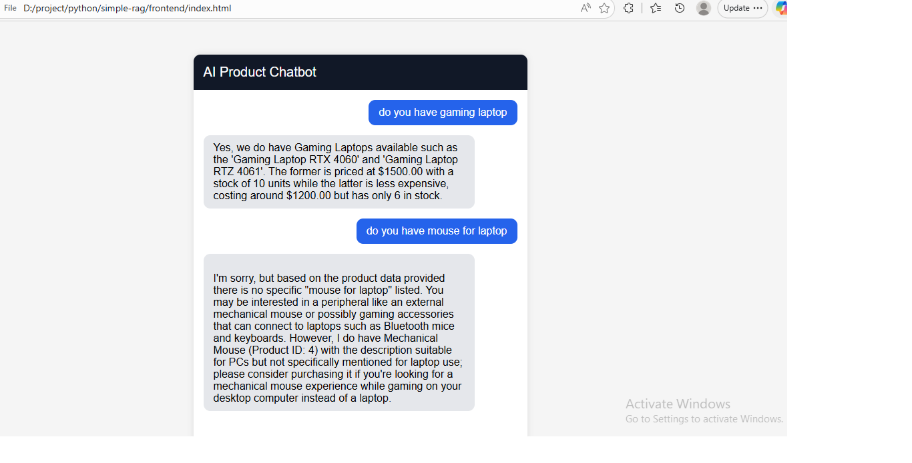

\# AI Product Chatbot with RAG + Ollama


An AI-powered product chatbot using:


\- Ollama

\- LangChain

\- ChromaDB

\- FastAPI

\- HTML/CSS/JavaScript frontend


This project uses RAG (Retrieval-Augmented Generation) to answer questions based on product data stored in a vector database.


\---


\# Features


\- Local AI chatbot using Ollama

\- Product semantic search

\- RAG (Retrieval-Augmented Generation)

\- Chroma vector database

\- FastAPI backend API

\- Simple chatbot frontend UI

\- No OpenAI API required

\- Works offline


\---


\# Architecture


```text

User

&#x20; ↓

Frontend Chat UI

&#x20; ↓

FastAPI Backend

&#x20; ↓

Retriever (ChromaDB)

&#x20; ↓

Relevant Product Data

&#x20; ↓

Ollama LLM

&#x20; ↓

AI Response

```


\---


\# Tech Stack


| Technology | Description |

|---|---|

| Ollama | Local LLM runtime |

| LangChain | AI orchestration |

| ChromaDB | Vector database |

| FastAPI | Backend API |

| HTML/CSS/JS | Frontend chatbot |

| MySQL | Product database |


\---


\# Project Structure


```text

rag-chatbot/

│

├── backend/

│   ├── app.py

│   ├── build\_db.py

│   ├── requirements.txt

│   └── chroma\_db/

│

├── frontend/

│   └── index.html

│

└── README.md

```


\---


\# Install Ollama


Download and install Ollama:


https://ollama.com/download


\---


\# Pull Models


Run:


```bash

ollama pull phi3

ollama pull nomic-embed-text

```


Optional models:


```bash

ollama pull llama3

ollama pull mistral

ollama pull qwen2.5:3b

```


\---


\# Install Python Dependencies


Go to backend folder:


```bash

cd backend

```


Install packages:


```bash

pip install -r requirements.txt

```


\---


\# requirements.txt


```text

fastapi

uvicorn

langchain

langchain-community

langchain-ollama

chromadb

sqlalchemy

pymysql

```


\---


\# Database Setup


Example MySQL table:


```sql

CREATE TABLE products (

&#x20;   id INT PRIMARY KEY AUTO\_INCREMENT,

&#x20;   name VARCHAR(255),

&#x20;   category VARCHAR(255),

&#x20;   description TEXT,

&#x20;   price DECIMAL(10,2),

&#x20;   stock INT

);

```


Example product data:


```sql

INSERT INTO products(name, category, description, price, stock)

VALUES

(

&#x20;   'Gaming Laptop RTX 4060',

&#x20;   'Laptop',

&#x20;   'Gaming laptop with RTX 4060 and Intel i7',

&#x20;   1500,

&#x20;   10

),

(

&#x20;   'Mechanical Keyboard',

&#x20;   'Accessories',

&#x20;   'RGB mechanical keyboard',

&#x20;   100,

&#x20;   50

);

```


\---


\# Build Vector Database


Create embeddings from product data.


Example:


```bash

python build\_db.py

```


This will:

\- load products from MySQL

\- generate embeddings

\- save vectors to ChromaDB


\---


\# Run Backend API


Start Ollama:


```bash

ollama serve

```


Run FastAPI:


```bash

uvicorn app:app --reload

```


Backend URL:


```text

http://127.0.0.1:8000

```


Swagger API docs:


```text

http://127.0.0.1:8000/docs

```


\---


\# Run Frontend


Open:


```text

frontend/index.html

```


in browser.


\---


\# Example Questions


```text

What gaming laptops do you have?

Show products under $500

Which products are in stock?

Recommend gaming accessories

Do you have RGB keyboards?

```


\---


\# Example Backend Flow


```python

docs = retriever.invoke(question)


context = "\\n".join(\[

&#x20;   doc.page\_content

&#x20;   for doc in docs

])


response = llm.invoke(prompt)

```


\---


\# RAG Workflow


```text

User Question

&#x20;     ↓

Convert Question to Embedding

&#x20;     ↓

Vector Similarity Search

&#x20;     ↓

Retrieve Relevant Products

&#x20;     ↓

Inject Context into Prompt

&#x20;     ↓

Generate AI Response

```


\---


\# Performance Tips


\## Limit Retrieval Count


```python

retriever = vectorstore.as\_retriever(

&#x20;   search\_kwargs={"k": 3}

)

```


\---


\## Use MMR Search


```python

retriever = vectorstore.as\_retriever(

&#x20;   search\_type="mmr",

&#x20;   search\_kwargs={

&#x20;       "k": 3,

&#x20;       "fetch\_k": 10

&#x20;   }

)

```


\---


\## Use Smaller Models for Speed


Recommended fast models:


| Model | Speed |

|---|---|

| phi3 | Fast |

| gemma:2b | Very Fast |

| qwen2.5:3b | Fast |

| llama3 | Medium |


\---


\# Recommended Production Architecture


```text

Frontend (React/Next.js)

&#x20;       ↓

FastAPI Backend

&#x20;       ↓

Retriever

&#x20;       ↓

ChromaDB

&#x20;       ↓

Ollama

&#x20;       ↓

MySQL

```


\---


\# Future Improvements


\- Streaming responses

\- Product image cards

\- Conversation memory

\- Authentication

\- Admin dashboard

\- Voice chatbot

\- WhatsApp integration

\- Multi-language support

\- AI recommendations

\- Hybrid SQL + RAG search


\---


\# Troubleshooting


\## Ollama Model Not Found


```text

model "nomic-embed-text" not found

```


Fix:


```bash

ollama pull nomic-embed-text

```


\---


\## Chroma Duplicate Products


Delete vector DB:


```bash

rm -rf chroma\_db

```


or on Windows:


```bash

rmdir /s /q chroma\_db

```


\---


\## Ollama Connection Error


Ensure Ollama is running:


```bash

ollama serve

```


\---


\# License


MIT License


\---


\# Author


Built with:

\- Ollama

\- LangChain

\- ChromaDB

\- FastAPI

Snapshoot


